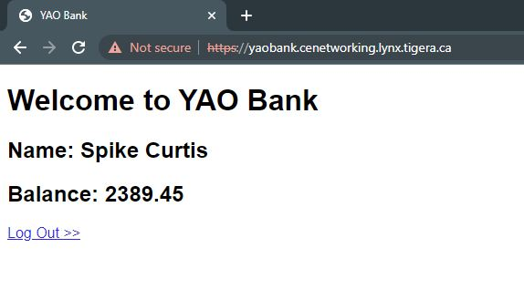

# In this lab

This lab provides the instructions to:

* [Overview](https://github.com/Pooriya-a/CalicoEnterprise-Networking-Training/blob/main/4.%20Kubernetes%20Services%20and%20CE%20Service%20Advertisement/README.md#overview)
* [Explore Kubernetes service ClusterIP iptables rules](https://github.com/Pooriya-a/CalicoEnterprise-Networking-Training/blob/main/4.%20Kubernetes%20Services%20and%20CE%20Service%20Advertisement/README.md#explore-kubernetes-service-clusterip-iptables-rules)
* [Explore Kubernetes service NodePort iptables rules](https://github.com/Pooriya-a/CalicoEnterprise-Networking-Training/blob/main/4.%20Kubernetes%20Services%20and%20CE%20Service%20Advertisement/README.md#explore-kubernetes-service-nodeport-iptables-rules)
* [Advertise the ServiceIP range using Calico Enterprise](https://github.com/Pooriya-a/CalicoEnterprise-Networking-Training/blob/main/4.%20Kubernetes%20Services%20and%20CE%20Service%20Advertisement/README.md#advertise-the-serviceip-range-using-calico-enterprise)
* [Advertise services with `externalTrafficPolicy: Local`to preserve the source IP and avoid extra hop in routing](https://github.com/Pooriya-a/CalicoEnterprise-Networking-Training/blob/main/4.%20Kubernetes%20Services%20and%20CE%20Service%20Advertisement/README.md#advertise-services-with-externaltrafficpolicy-localto-preserve-the-source-ip-and-avoid-extra-hop-in-routing)
* [Expose a service using Ingress resource](https://github.com/Pooriya-a/CalicoEnterprise-Networking-Training/blob/main/4.%20Kubernetes%20Services%20and%20CE%20Service%20Advertisement/README.md#expose-a-service-using-ingress-resource)


## Overview

Kubernetes is a dynamic environment and pods are not permanent resources. Pods are created and destroyed to match the desired state of your cluster. Since Pods and their IP addresses are ephemeral resources, Kubernetes provides a virtual entity called service as a permanent point of network communication between Pods. Once a service is created, it will stay there until deleted. Services provide a dns name and virtual IP address. In the context of Kubernetes service, pods are called endpoints. Kubernetes uses service controller, which it turn uses labels and selectors to keep the service endpoints update to date as pods are created and destroyed. 

By default, Kubernetes service cluster IPs are accessible only within the cluster and external access to the service requires a dedicated load balancer or ingress controller. Calico Enterprise enables you to advertise Kubernetes service IPs outside a cluster. Calico Enterprise supports advertising a service’s cluster IPs and external IPs. In cases where a service’s cluster IP is not routable, the service can be accessed using its external IP.

After finshing this lab, you should gain a good understanding of Kubernetes services and how to use Calico Enterprise to advertise Kubernetes services.

_______________________________________________________________________________________________________________________________________________________________________

### Explore Kubernetes service ClusterIP iptables rules

There are four types of Kubernetes services. ClusterIP, NodePort, LoadBalancer, and ExternalName. kube-proxy is the Kubernetes service agent that is responsible for implementing Kubernetes services definitions in a Kubernetes environment. In this section, we will explore how kube-proxy uses iptables to implement Kubernetes service `ClusterIP`. `ClusterIP` service is the default service type and is used to expose a service on an IP address that is internal to the cluster.

1. We will run this lab from `worker1` so we can explore the iptables rules that kube-proxy has set up. Run the following command to ssh into `worker1`.

```
ssh worker1
```

2. Let's take a look at the services and pods in the `yaobank` kubernetes namespace. We should have three services deployed. One `NodePort` service and two `ClusterIP` services.

```
kubectl get svc -n yaobank
```
```
NAME       TYPE        CLUSTER-IP     EXTERNAL-IP   PORT(S)        AGE
customer   NodePort    10.49.60.52    <none>        80:30180/TCP   2d2h
database   ClusterIP   10.49.164.49   <none>        2379/TCP       2d2h
summary    ClusterIP   10.49.80.32    <none>        80/TCP         2d2h
```

3. Run the following command to find the endpoints for each one of the services in yaobank namespace.

```
kubectl get endpoints -n yaobank
```
```
NAME       ENDPOINTS                         AGE
customer   10.48.0.43:80                     2d2h
database   10.48.128.0:2379                  2d2h
summary    10.48.128.1:80,10.48.128.192:80   2d2h
```

4. List the pods in the yaobank namespace.

```
kubectl get pods -n yaobank -o wide
```

```
NAME                        READY   STATUS    RESTARTS   AGE    IP              NODE                                      NOMINATED NODE   READINESS GATES
customer-687b8d8f74-tcclp   1/1     Running   0          2d2h   10.48.0.43      ip-10-0-1-31.eu-west-1.compute.internal   <none>           <none>
database-75ccfdc84f-hqr64   1/1     Running   0          2d2h   10.48.128.0     ip-10-0-1-31.eu-west-1.compute.internal   <none>           <none>
summary-7d78c9976b-sxv4k    1/1     Running   0          2d2h   10.48.128.192   ip-10-0-1-30.eu-west-1.compute.internal   <none>           <none>
summary-7d78c9976b-wjdd5    1/1     Running   0          2d2h   10.48.128.1     ip-10-0-1-31.eu-west-1.compute.internal   <none>           <none>
```

You can see that the IP addresses listed as the service endpoints in the previous step map to the backing pods in the yaobank namespace as expected. Each service is backed by one or more pods spread across the nodes in the cluster.


5. Let's explore the iptables rules that implement the `summary` service. Let's start by finding the service endpoints for the `summary` `ClusterIP` service.

```
kubectl get endpoints -n yaobank summary
```

```
NAME      ENDPOINTS                         AGE
summary   10.48.128.1:80,10.48.128.192:80   2d2h
```

6. As per the previous output, the `summary` service has two endpoints (`10.48.128.1` on port `80` AND `10.48.128.192` on port `80` in this example output). Starting from the `KUBE-SERVICES` iptables chain, we will traverse each chain until you get to the rule directing traffic to these endpoint IP addresses.

7. Let's examine the KUBE-SERVICE chain.

```
sudo iptables -v --numeric --table nat --list KUBE-SERVICES | column -t
```

```
Chain  KUBE-SERVICES  (2                         references)
pkts   bytes          target                     prot         opt  in  out  source     destination
8      480            KUBE-SVC-3NJEN5CBT7DGINLD  tcp          --   *   *    0.0.0.0/0  10.49.69.235   /*  tigera-elasticsearch/tigera-secure-es-gateway-http:es-gateway-elasticsearch-port  cluster  IP          */     tcp   dpt:9200
104    12362          KUBE-SVC-TCOU7JCQXEZGVUNU  udp          --   *   *    0.0.0.0/0  10.49.0.10     /*  kube-system/kube-dns:dns                                                          cluster  IP          */     udp   dpt:53
0      0              KUBE-SVC-P37GYSV6HJH3GAT2  tcp          --   *   *    0.0.0.0/0  10.49.241.76   /*  tigera-packetcapture/tigera-packetcapture:tigera-packetcapture                    cluster  IP          */     tcp   dpt:443
0      0              KUBE-SVC-P7GI5BPQ3GTNT5FK  tcp          --   *   *    0.0.0.0/0  10.49.105.153  /*  tigera-prometheus/calico-node-alertmanager:web                                    cluster  IP          */     tcp   dpt:9093
0      0              KUBE-SVC-3XH7Z4WONXPKZ54M  tcp          --   *   *    0.0.0.0/0  10.49.146.237  /*  tigera-kibana/tigera-secure-kb-http:https                                         cluster  IP          */     tcp   dpt:5601
0      0              KUBE-SVC-PX5FENG4GZJTCELT  tcp          --   *   *    0.0.0.0/0  10.49.60.52    /*  yaobank/customer:http                                                             cluster  IP          */     tcp   dpt:80
0      0              KUBE-SVC-JD5MR3NA4I4DYORP  tcp          --   *   *    0.0.0.0/0  10.49.0.10     /*  kube-system/kube-dns:metrics                                                      cluster  IP          */     tcp   dpt:9153
0      0              KUBE-SVC-BPJNZGPODTH4UZQI  tcp          --   *   *    0.0.0.0/0  10.49.199.67   /*  calico-system/calico-node-metrics:calico-metrics-port                             cluster  IP          */     tcp   dpt:9081
0      0              KUBE-SVC-KQVGIOWQAVNMB2ZL  tcp          --   *   *    0.0.0.0/0  10.49.22.249   /*  calico-system/calico-kube-controllers-metrics:metrics-port                        cluster  IP          */     tcp   dpt:9094
0      0              KUBE-SVC-FQBB24OXOBQUPC7L  tcp          --   *   *    0.0.0.0/0  10.49.75.250   /*  tigera-prometheus/prometheus-http-api:web                                         cluster  IP          */     tcp   dpt:9090
7      420            KUBE-SVC-27GAF2D4QQPTKE7C  tcp          --   *   *    0.0.0.0/0  10.49.31.204   /*  tigera-elasticsearch/tigera-secure-es-http:https                                  cluster  IP          */     tcp   dpt:9200
0      0              KUBE-SVC-HWMH37Q2Y4HJ5UPP  tcp          --   *   *    0.0.0.0/0  10.49.160.225  /*  tigera-fluentd/fluentd-metrics:fluentd-metrics-port                               cluster  IP          */     tcp   dpt:9081
0      0              KUBE-SVC-AE2X4VPDA5SRYCA6  tcp          --   *   *    0.0.0.0/0  10.49.164.49   /*  yaobank/database:http                                                             cluster  IP          */     tcp   dpt:2379
0      0              KUBE-SVC-BXX6NV5PBDEKW23Y  tcp          --   *   *    0.0.0.0/0  10.49.114.47   /*  tigera-system/tigera-api:queryserver                                              cluster  IP          */     tcp   dpt:8080
0      0              KUBE-SVC-OIQIZJVJK6E34BR4  tcp          --   *   *    0.0.0.0/0  10.49.80.32    /*  yaobank/summary:http                                                              cluster  IP          */     tcp   dpt:80
63     3780           KUBE-SVC-ERIFXISQEP7F7OF4  tcp          --   *   *    0.0.0.0/0  10.49.0.10     /*  kube-system/kube-dns:dns-tcp                                                      cluster  IP          */     tcp   dpt:53
0      0              KUBE-SVC-VWTJDZUOIAKKPMUV  tcp          --   *   *    0.0.0.0/0  10.49.251.45   /*  tigera-compliance/compliance:compliance-api                                       cluster  IP          */     tcp   dpt:443
0      0              KUBE-SVC-YFF642K22PZPYCSR  tcp          --   *   *    0.0.0.0/0  10.49.191.172  /*  tigera-elasticsearch/tigera-elasticsearch-metrics:metrics-port                    cluster  IP          */     tcp   dpt:9081
0      0              KUBE-SVC-5YT3S4Q5ZQB7MXPI  tcp          --   *   *    0.0.0.0/0  10.49.114.47   /*  tigera-system/tigera-api:apiserver                                                cluster  IP          */     tcp   dpt:443
0      0              KUBE-SVC-RK657RLKDNVNU64O  tcp          --   *   *    0.0.0.0/0  10.49.179.78   /*  calico-system/calico-typha:calico-typha                                           cluster  IP          */     tcp   dpt:5473
0      0              KUBE-SVC-ZMPNACNGKBKCFXCW  tcp          --   *   *    0.0.0.0/0  10.49.199.67   /*  calico-system/calico-node-metrics:calico-bgp-metrics-port                         cluster  IP          */     tcp   dpt:9900
0      0              KUBE-SVC-LHFU7GY5JD5I4Q3O  tcp          --   *   *    0.0.0.0/0  10.49.47.211   /*  tigera-elasticsearch/tigera-secure-es-internal-http:https                         cluster  IP          */     tcp   dpt:9200
0      0              KUBE-SVC-TQCARI64B4Y6IXTV  tcp          --   *   *    0.0.0.0/0  10.49.69.235   /*  tigera-elasticsearch/tigera-secure-es-gateway-http:es-gateway-kibana-port         cluster  IP          */     tcp   dpt:5601
0      0              KUBE-SVC-HNOWWVZB7NMFCWE4  tcp          --   *   *    0.0.0.0/0  10.49.246.160  /*  tigera-intrusion-detection/anomaly-detection-api:anomaly-detection-api-https      cluster  IP          */     tcp   dpt:8080
0      0              KUBE-SVC-QJP4DZODROFX2FWR  tcp          --   *   *    0.0.0.0/0  10.49.194.132  /*  tigera-manager/tigera-manager                                                     cluster  IP          */     tcp   dpt:9443
0      0              KUBE-SVC-NPX46M4PTMTKRN6Y  tcp          --   *   *    0.0.0.0/0  10.49.0.1      /*  default/kubernetes:https                                                          cluster  IP          */     tcp   dpt:443
0      0              KUBE-SVC-EZYNCFY2F7N6OQA2  tcp          --   *   *    0.0.0.0/0  10.49.242.76   /*  ingress-nginx/ingress-nginx-controller-admission:https-webhook                    cluster  IP          */     tcp   dpt:443
321    19296          KUBE-NODEPORTS             all          --   *   *    0.0.0.0/0  0.0.0.0/0      /*  kubernetes                                                                        service  nodeports;  NOTE:  this  must      be  the  last  rule  in  this  chain  */  ADDRTYPE  match  dst-type  LOCAL
```

Each iptables chain consists of a list of rules that are executed in order until a rule matches. The key columns/elements to note in this output are:
* `target` - which chain iptables will jump to if the rule matches
* `prot` - the protocol match criteria
* `source`, and `destination` - the source and destination IP address match criteria
* the comments that kube-proxy inculdes
* the additional match criteria at the end of each rule - e.g `dpt:80` that specifies the destination port match

8. Now let's look more closely at the rules for the `summary` service.

```
sudo iptables -v --numeric --table nat --list KUBE-SERVICES | grep -E summary | column -t
```
You should see an output similar to the following.
```
0  0  KUBE-SVC-OIQIZJVJK6E34BR4  tcp  --  *  *  0.0.0.0/0  10.49.80.32  /*  yaobank/summary:http  cluster  IP  */  tcp  dpt:80
```

9. The rule above directs traffic destined for the summary service clusterIP (`10.49.80.32` in the example output) to the chain that load balances the service (KUBE-SVC-XXXXXXXXXXXXXXXX).

10. `kube-proxy` in `iptables` mode uses an equal probability algorithm to load balance traffic between pods.  We currently have two `summary` pods.

Let's examine how this loadbalancing works among the Kubernetes service endpoints. (Remember your chain name may be different than this example.)

```
sudo iptables -v --numeric --table nat --list KUBE-SVC-OIQIZJVJK6E34BR4 | column -t
```

```
Chain  KUBE-SVC-OIQIZJVJK6E34BR4  (1                         references)
pkts   bytes                      target                     prot         opt  in  out  source         destination
0      0                          KUBE-MARK-MASQ             tcp          --   *   *    !10.48.0.0/16  10.49.80.32  /*  yaobank/summary:http  cluster  IP         */    tcp     dpt:80
0      0                          KUBE-SEP-NCOI6JAXVX2D4BXJ  all          --   *   *    0.0.0.0/0      0.0.0.0/0    /*  yaobank/summary:http  */       statistic  mode  random  probability  0.50000000000
0      0                          KUBE-SEP-TVZHKMXMBG2BIHXS  all          --   *   *    0.0.0.0/0      0.0.0.0/0    /*  yaobank/summary:http  */
```

Notice that `kube-proxy` is using the `iptables` `statistic` module to set the probability for a packet to be randomly matched.  Make sure you scroll all the way to the right to see the full output.

The second rule directs traffic destined for the `summary` service to the chain that delivers packets to the first service endpoint (KUBE-SEP-NCOI6JAXVX2D4BXJ) with a probability of 0.50000000000.
The third rule unconditionally directs to the second service endpoint chain (KUBE-SEP-TVZHKMXMBG2BIHXS). The result is that traffic is load balanced across the service endpoints equally (on average).

If there were 3 service endpoints, then the first chain match would be probability of 0.33333333, the second probability of 0.5, and the last unconditional. The result is each service endpoint receives a third of the traffic (on average).


11. Let's look at one of the service endpoint chains. (Remember your chain names may be different than this example.)
```
sudo iptables -v --numeric --table nat --list KUBE-SEP-NCOI6JAXVX2D4BXJ | column -t
```

```
Chain  KUBE-SEP-NCOI6JAXVX2D4BXJ  (1              references)
pkts   bytes                      target          prot         opt  in  out  source         destination
0      0                          KUBE-MARK-MASQ  all          --   *   *    10.48.128.192  0.0.0.0/0    /*  yaobank/summary:http  */
0      0                          DNAT            tcp          --   *   *    0.0.0.0/0      0.0.0.0/0    /*  yaobank/summary:http  */  tcp  to:10.48.128.192:80
```

12. The second rule performs the DNAT that changes the destination IP from the service's clusterIP to the IP address of the service endpoint backing pod (`10.48.128.192` in this example). After this, standard Linux routing can handle forwarding the packet like it would for any other packet.

**Recap**

You've just traced the kube-proxy iptables rules used to load balance traffic to `summary` pods exposed as a service of type `ClusterIP`.

In summary, for a packet being sent to a clusterIP:
* The KUBE-SERVICES chain matches on the clusterIP and jumps to the corresponding KUBE-SVC-XXXXXXXXXXXXXXXX chain.
* The KUBE-SVC-XXXXXXXXXXXXXXXX chain load balances the packet to a random service endpoint KUBE-SEP-XXXXXXXXXXXXXXXX chain.
* The KUBE-SEP-XXXXXXXXXXXXXXXX chain DNATs the packet so it will get routed to the service endpoint (backing pod).


_______________________________________________________________________________________________________________________________________________________________________


### Explore Kubernetes service NodePort iptables rules

`NodePort` service enables us to expose a service outside the cluster using a static port on the cluster nodes. To reach a NodePort service from outside the cluster, we just need to use any of the cluster nodes IP addresses along with a port on the node. The default port range for NodePort is 30000-32767, but this range can be changed or extended through the kube-apiserver configuration.

1. Let's explore the iptables rules that implement the `customer` service. Find the service endpoints for `customer` `NodePort` service. Keeping using `worker1` to follow the instructions.

```
kubectl get endpoints -n yaobank customer
```

```
NAME       ENDPOINTS       AGE
customer   10.48.0.43:80   2d2h
```

2. The `customer` service has one endpoint (`10.48.0.43` on port `80` in this example output). Starting from the `KUBE-SERVICES` iptables chain, we will traverse each chain until you get to the rule directing traffic to this endpoint IP address.

**Note:** The `KUBE-SERVICE` chain handles the matching for service types `ClusterIP` and `LoadBalancer`. At the end of `KUBE-SERVICE` chain, another custom chain `KUBE-NODEPORTS` will handle traffic for service type `NodePort`.

```
sudo iptables -v --numeric --table nat --list KUBE-SERVICES | grep KUBE-NODEPORTS | column -t
```

```
80  4836  KUBE-NODEPORTS  all  --  *  *  0.0.0.0/0  0.0.0.0/0  /*  kubernetes  service  nodeports;  NOTE:  this  must  be  the  last  rule  in  this  chain  */  ADDRTYPE  match  dst-type  LOCAL
```

3. `match dst-type LOCAL` matches any packet with a local host IP as the destination. i.e. any address that is assigned to one of the host's interfaces.

4. Now let's look more closely at the rules for the `customer` service.

```
sudo iptables -v --numeric --table nat --list KUBE-NODEPORTS | column -t
```

```
Chain  KUBE-NODEPORTS  (1                         references)
pkts   bytes           target                     prot         opt  in  out  source     destination
0      0               KUBE-SVC-PX5FENG4GZJTCELT  tcp          --   *   *    0.0.0.0/0  0.0.0.0/0    /*  yaobank/customer:http  */  tcp  dpt:30180
```

The rule above directs traffic destined for the `customer` service to the chain that load balances the service (KUBE-SVC-PX5FENG4GZJTCELT). `tcp dpt:30180` matches any packet with the destination port of tcp 30180 (the node port of the `customer` service).

5. `kube-proxy` in `iptables` mode uses an equal probability algorithm to load balance traffic between pods.  We currently have one `customer` pod.

Let's examine how this loadbalancing works among the Kubernetes service endpoints. (Remember your chain name may be different than this example.)

```
sudo iptables -v --numeric --table nat --list KUBE-SVC-PX5FENG4GZJTCELT | column -t
```

```
Chain  KUBE-SVC-PX5FENG4GZJTCELT  (2                         references)
pkts   bytes                      target                     prot         opt  in  out  source         destination
0      0                          KUBE-MARK-MASQ             tcp          --   *   *    !10.48.0.0/16  10.49.60.52  /*  yaobank/customer:http  cluster  IP   */         tcp  dpt:80
0      0                          KUBE-MARK-MASQ             tcp          --   *   *    0.0.0.0/0      0.0.0.0/0    /*  yaobank/customer:http  */       tcp  dpt:30180
0      0                          KUBE-SEP-GNFCEQXJBZQ2TQAR  all          --   *   *    0.0.0.0/0      0.0.0.0/0    /*  yaobank/customer:http  */
```

As we only have a single backing pod for the `customer` service, there is no loadbalancing to do, so there is a single rule (last rule) that directs all traffic to the chain that delivers the packet to the service endpoint (KUBE-SEP-XXXXXXXXXXXXXXXX).

6. Finally, lets' look into the KUBE-SEP-XXXXXXXXXXXXXXXX to `customer` endpoint. This rule delivers the packet to the `customer` service endpoint.

```
sudo iptables -v --numeric --table nat --list KUBE-SEP-GNFCEQXJBZQ2TQAR | column -t
```

```
Chain  KUBE-SEP-GNFCEQXJBZQ2TQAR  (1              references)
pkts   bytes                      target          prot         opt  in  out  source      destination
0      0                          KUBE-MARK-MASQ  all          --   *   *    10.48.0.43  0.0.0.0/0    /*  yaobank/customer:http  */
0      0                          DNAT            tcp          --   *   *    0.0.0.0/0   0.0.0.0/0    /*  yaobank/customer:http  */  tcp  to:10.48.0.43:80
```

The second rule performs the DNAT that changes the destination IP from the service's NodePort to the IP address of the service endpoint backing pod (`10.48.0.43` in this example). After this, standard Linux routing can handle forwarding the packet like it would for any other packet.

**Recap**

You've just traced the kube-proxy iptables rules used to load balance traffic to `customer` pods exposed as a service of type `NodePort`.

In summary, for a packet being sent to a NodePort:

* The end of the KUBE-SERVICES chain jumps to the KUBE-NODEPORTS chain
* The KUBE-NODEPORTS chaing matches on the NodePort and jumps to the corresponding KUBE-SVC-XXXXXXXXXXXXXXXX chain.
* The KUBE-SVC-XXXXXXXXXXXXXXXX chain load balances the packet to a random service endpoint KUBE-SEP-XXXXXXXXXXXXXXXX chain.
* The KUBE-SEP-XXXXXXXXXXXXXXXX chain DNATs the packet so it will get routed to the service endpoint (backing pod).


_______________________________________________________________________________________________________________________________________________________________________


### Advertise the ServiceIP range using Calico Enterprise

Calico Enterprise BGP service advertisement allows you to directly access the service without using a NodePorts or LoadBalancer service or a cluster Ingress Controller.

1. let's by taking look at the state of routes on the bastion node. If you completed the previous lab correctly, you should see one route that was learned from Calico that provides access to the nginx pod that was created in the externally routable namespace (the route ending in `proto bird` in this example output). In this lab we will advertise Kubernetes services (rather than individual pods) over BGP.

```
ip route
```

```
default via 10.0.1.1 dev ens5 proto dhcp src 10.0.1.10 metric 100 
10.0.1.0/24 dev ens5 proto kernel scope link src 10.0.1.10 
10.0.1.1 dev ens5 proto dhcp scope link src 10.0.1.10 metric 100 
10.48.2.216/29 via 10.0.1.31 dev ens5 proto bird
```

2. Run the following and command and ensure that there is no bgpconfigurations in your cluster.

**Note:** A BGP configuration resource (BGPConfiguration) represents BGP specific configuration options for the cluster or a specific node. The resource with the name default has a specific meaning and contains the BGP global default configuration. By the default, there is no BGPConfiguration resource deployed in the cluster. However, Once BGP is activated, Calico has default built-in configurations for BGP in its data model. For example, it use 64512 as the default AS number.

```
kubectl get bgpconfigurations
```
You should receive the following output.
```
No resources found
```

3. Examine the following default BGP configuration and then apply it.

```
kubectl apply -f -<<EOF
apiVersion: projectcalico.org/v3
kind: BGPConfiguration
metadata:
  name: default
spec:
  serviceClusterIPs:
  - cidr: "10.49.0.0/16"
EOF

```
The `serviceClusterIPs` parameter tells Calico to advertise the cluster IP range.


4. Verify the BGPConfiguration just implemented.

```
kubectl get bgpconfigurations default -o yaml
```

```
apiVersion: projectcalico.org/v3
kind: BGPConfiguration
metadata:
  annotations:
    kubectl.kubernetes.io/last-applied-configuration: |
      {"apiVersion":"projectcalico.org/v3","kind":"BGPConfiguration","metadata":{"annotations":{},"name":"default"},"spec":{"serviceClusterIPs":[{"cidr":"10.49.0.0/16"}]}}
  creationTimestamp: "2023-01-01T20:50:02Z"
  name: default
  resourceVersion: "777183"
  uid: 491661bb-d525-44c1-89a9-f4562f614232
spec:
  serviceClusterIPs:
  - cidr: 10.49.0.0/16
```

5. Now that we have enabled Service ClusterIP advertisement, let's examine the routes on bastion node again.

```
ip route
```

```
default via 10.0.1.1 dev ens5 proto dhcp src 10.0.1.10 metric 100 
10.0.1.0/24 dev ens5 proto kernel scope link src 10.0.1.10 
10.0.1.1 dev ens5 proto dhcp scope link src 10.0.1.10 metric 100 
10.48.2.216/29 via 10.0.1.31 dev ens5 proto bird 
10.49.0.0/16 proto bird 
        nexthop via 10.0.1.20 dev ens5 weight 1 
        nexthop via 10.0.1.30 dev ens5 weight 1 
        nexthop via 10.0.1.31 dev ens5 weight 1
```

You should now see the cluster service cidr `10.49.0.0/16` advertised from each of the kubernetes cluster nodes. This means that traffic to any service's cluster IP address will get load-balanced across all nodes in the cluster by the network using ECMP (Equal Cost Multi Path). Kube-proxy then load balances the cluster IP across the service endpoints (backing pods) in exactly the same way as if a pod had accessed a service via a cluster IP from within the cluster.


6. Let's verify connectivity through the clusterIP. Find the cluster IP for the `customer` service.

```
kubectl get svc -n yaobank customer
```

```
NAME       TYPE       CLUSTER-IP    EXTERNAL-IP   PORT(S)        AGE
customer   NodePort   10.49.60.52   <none>        80:30180/TCP   2d3h
```

In this case, the ClusterIP is `10.49.60.52`. Your IP may be different.

7. Confirm you can access it from the bastion host.

```
curl 10.49.60.52
```

```
<!DOCTYPE html PUBLIC "-//W3C//DTD XHTML 1.0 Transitional//EN"
  "http://www.w3.org/TR/xhtml1/DTD/xhtml1-transitional.dtd">

<html xmlns="http://www.w3.org/1999/xhtml">
  <head>
    <title>YAO Bank</title>
    <style>
    h2 {
      font-family: Arial, Helvetica, sans-serif;
    }
    h1 {
      font-family: Arial, Helvetica, sans-serif;
    }
    p {
      font-family: Arial, Helvetica, sans-serif;
    }
    </style>
  </head>
  <body>
        <h1>Welcome to YAO Bank</h1>
        <h2>Name: Spike Curtis</h2>
        <h2>Balance: 2389.45</h2>
        <p><a href="/logout">Log Out >></a></p>
  </body>
</html>
```


_______________________________________________________________________________________________________________________________________________________________________


### Advertise services with `externalTrafficPolicy: Local`to preserve the source IP and avoid extra hop in routing

You can set `externalTrafficPolicy: Local` on a Kubernetes service to request that external traffic to a service only be routed via nodes which have a local service endpoint (backing pod). This preserves the client source IP and avoids the second hop when kube-proxy loadbalances to a service endpoint (backing pod) on another node. 

Traffic to the cluster IP for a service with `externalTrafficPolicy: Local` will be load-balanced across the nodes with endpoints for that service.
Note that `externalTrafficPolicy: Local` is only supported with service types of LoadBalancer and NodePort. For more information, visit the following link.

https://docs.tigera.io/networking/advertise-service-ips


1. Let's start by updating the `customer` service to add `externalTrafficPolicy: Local`.

```
kubectl patch svc -n yaobank customer -p '{"spec":{"externalTrafficPolicy":"Local"}}'
```

```
service/customer patched
```

2. Examine the routes on bastion node.

```
ip route
```

```
default via 10.0.1.1 dev ens5 proto dhcp src 10.0.1.10 metric 100 
10.0.1.0/24 dev ens5 proto kernel scope link src 10.0.1.10 
10.0.1.1 dev ens5 proto dhcp scope link src 10.0.1.10 metric 100 
10.48.2.216/29 via 10.0.1.31 dev ens5 proto bird 
10.49.0.0/16 proto bird 
        nexthop via 10.0.1.20 dev ens5 weight 1 
        nexthop via 10.0.1.30 dev ens5 weight 1 
        nexthop via 10.0.1.31 dev ens5 weight 1 
10.49.60.52 via 10.0.1.31 dev ens5 proto bird 
```

3. You should now have a `/32` route for the yaobank customer service (`10.49.60.52` in the above example output) advertised from the node hosting the customer service pod (worker1, `10.0.1.30` in this example output).

```
kubectl get pods -n yaobank -l app=customer -o wide
```

```
NAME                        READY   STATUS    RESTARTS   AGE    IP           NODE                                      NOMINATED NODE   READINESS GATES
customer-687b8d8f74-tcclp   1/1     Running   0          2d3h   10.48.0.43   ip-10-0-1-31.eu-west-1.compute.internal   <none>           <none>
```

For each active service with `externalTrafficPolicy: Local`, Calico advertise the IP for that service as a `/32` route from the nodes that have endpoints for that service. This means that external traffic to the service will get load-balanced across all nodes in the cluster that have a service endpoint (backing pod) for the service by the network using ECMP (Equal Cost Multi Path). Kube-proxy then DNATs the traffic to the local backing pod on that node (or load-balances equally to the local backing pods if there is more than one on the node).

The two main advantages of using `externalTrafficPolicy: Local` in this way are:
* There is a network efficiency win avoiding potential second hop of kube-proxy load-balancing to another node
* The client source IP addresses are preserved, which can be useful if you want to restrict access to a service to specific IP addresses using network policy applied to the backing pods


4. In the previous labs, we accessed the yaobank frontend UI using curl from the `control1` node and we also mentioned that we can try any other cluster node IP address to hit the NodePort. As we've now set `externalTrafficPolicy: Local`, this will no longer work since there are no `customer` pods hosted on `control1`. Accessing the NodePort can only happen via `worker1` at this point.

5. The following should fail because of `externalTrafficPolicy: Local` configured on the `customer` service.

```
curl 10.0.1.20:30180
```
 6. The following should go through. Please make sure to use the node IP address where customer pod is running. 

```
curl 10.0.1.31:30180
```
```
<!DOCTYPE html PUBLIC "-//W3C//DTD XHTML 1.0 Transitional//EN"
  "http://www.w3.org/TR/xhtml1/DTD/xhtml1-transitional.dtd">

<html xmlns="http://www.w3.org/1999/xhtml">
  <head>
    <title>YAO Bank</title>
    <style>
    h2 {
      font-family: Arial, Helvetica, sans-serif;
    }
    h1 {
      font-family: Arial, Helvetica, sans-serif;
    }
    p {
      font-family: Arial, Helvetica, sans-serif;
    }
    </style>
  </head>
  <body>
        <h1>Welcome to YAO Bank</h1>
        <h2>Name: Spike Curtis</h2>
        <h2>Balance: 2389.45</h2>
        <p><a href="/logout">Log Out >></a></p>
  </body>
```

_______________________________________________________________________________________________________________________________________________________________________

### Expose a service using Ingress resource

Kubernetes Ingress is an API object that provides routing rules to manage external users' access to the services in a Kubernetes cluster, typically via HTTPS/HTTP. With Ingress, you can easily set up rules for routing traffic without creating a bunch of Load Balancers or exposing each service on the node. [IBM Source](https://www.ibm.com/cloud/blog/kubernetes-ingress#:~:text=Kubernetes%20Ingress%20is%20an%20API,each%20service%20on%20the%20node.)

In this section, we will use an ingress controller to expose the Yaobank Customer service.

1. Let's start with removing the previous yaobank deployment and proceed to deploying the new configuration. For simplicity, let's just remove the namespace, which deletes all included objects. It might take 1-2 minutes for the namespace to get deleted. Please wait until the namespace is deleted.

```
kubectl delete ns yaobank
```

2. Deploy an ingress controller that listens to all namespaces

Ingress is the built-in kubernetes framework for load-balancing http traffic. Cloud providers offer a similar functionality out of the box via cloud load-balancers. Ingress allows the manipulation of incoming http requests, natting/routing traffic to back-end services based on provided host/path, or even passing-through traffic. It can effectively provide L7-based policies and typical load-balancing features such as stickiness, health probes, or weight-based load-balancing.

Let's start with examining the already deployed ingress controller.

```
kubectl get all -n ingress-nginx
```

```
NAME                                       READY   STATUS      RESTARTS   AGE
pod/ingress-nginx-admission-create-5sc7j   0/1     Completed   0          2d22h
pod/ingress-nginx-admission-patch-mx6rf    0/1     Completed   0          2d22h
pod/ingress-nginx-controller-9rxrv         1/1     Running     0          2d22h
pod/ingress-nginx-controller-vdsbl         1/1     Running     0          2d22h

NAME                                         TYPE        CLUSTER-IP     EXTERNAL-IP   PORT(S)   AGE
service/ingress-nginx-controller-admission   ClusterIP   10.49.242.76   <none>        443/TCP   2d22h

NAME                                      DESIRED   CURRENT   READY   UP-TO-DATE   AVAILABLE   NODE SELECTOR            AGE
daemonset.apps/ingress-nginx-controller   2         2         2       2            2           kubernetes.io/os=linux   2d22h

NAME                                       COMPLETIONS   DURATION   AGE
job.batch/ingress-nginx-admission-create   1/1           8s         2d22h
job.batch/ingress-nginx-admission-patch    1/1           10s        2d22h
```

Key things to look in the output are:

* The ingress has been deployed as a DaemonSet to be run on each of the worker nodes, so you should have two of them running.
* The ingress controller uses a service of type ClusterIP listening on port 443.

Nginx ingress controller, by default, listens to all namespaces. Once an Ingress object is created in any namespace, it will create the necessary rules to forward the traffic. This default behaviour can be modified to limit ingress controller to a specific namespace.

Currently we have not created any ingress resource in the yaobank namespace yet. So if we try to access our lab instance on port 443 using our browser `https:\\yaobank.<LabName>.lynx.tigera.ca`, we will get a 404 error from our ingress controller.

3. Deploy the new instance of yaobank app.

```
kubectl apply -f -<<EOF
apiVersion: v1
kind: Namespace
apiVersion: v1
metadata:
  name: yaobank
  labels:
    istio-injection: disabled

---
apiVersion: v1
kind: Service
metadata:
  name: database
  namespace: yaobank
  labels:
    app: database
spec:
  ports:
  - port: 2379
    name: http
  selector:
    app: database
---
apiVersion: v1
kind: ServiceAccount
metadata:
  name: database
  namespace: yaobank
  labels:
    app: yaobank
---
apiVersion: apps/v1
kind: Deployment
metadata:
  name: database
  namespace: yaobank
spec:
  replicas: 1
  selector:
    matchLabels:
      app: database
      version: v1
  template:
    metadata:
      labels:
        app: database
        version: v1
    spec:
      serviceAccountName: database
      containers:
      - name: database
        image: calico/yaobank-database:certification
        imagePullPolicy: IfNotPresent
        ports:
        - containerPort: 2379
        command: ["etcd"]
        args:
          - "-advertise-client-urls"
          - "http://database:2379"
          - "-listen-client-urls"
          - "http://0.0.0.0:2379"
---
apiVersion: v1
kind: Service
metadata:
  name: summary
  namespace: yaobank
  labels:
    app: summary
spec:
  ports:
  - port: 80
    name: http
  selector:
    app: summary
---
apiVersion: v1
kind: ServiceAccount
metadata:
  name: summary
  namespace: yaobank
  labels:
    app: yaobank
    database: reader
---
apiVersion: apps/v1
kind: Deployment
metadata:
  name: summary
  namespace: yaobank
spec:
  replicas: 2
  selector:
    matchLabels:
      app: summary
      version: v1
  template:
    metadata:
      labels:
        app: summary
        version: v1
    spec:
      serviceAccountName: summary
      containers:
      - name: summary
        image: calico/yaobank-summary:certification
        imagePullPolicy: Always
        ports:
        - containerPort: 80
---
apiVersion: v1
kind: Service
metadata:
  name: customer
  namespace: yaobank
  labels:
    app: customer
spec:
  ports:
  - port: 80
    name: http
  selector:
    app: customer
---
apiVersion: v1
kind: ServiceAccount
metadata:
  name: customer
  namespace: yaobank
  labels:
    app: yaobank
    summary: reader
---

apiVersion: apps/v1
kind: Deployment
metadata:
  name: customer
  namespace: yaobank
spec:
  replicas: 1
  selector:
    matchLabels:
      app: customer
      version: v1
  template:
    metadata:
      labels:
        app: customer
        version: v1
    spec:
      serviceAccountName: customer
      containers:
      - name: customer
        image: calico/yaobank-customer:certification
        imagePullPolicy: Always
        ports:
        - containerPort: 80
EOF

```

4. Make sure the yaobank pods are running.

```
kubectl get pods -n yaobank
```
```
NAME                        READY   STATUS    RESTARTS   AGE
customer-687b8d8f74-hdr6f   1/1     Running   0          21m
database-545f6d6d95-5m4k2   1/1     Running   0          21m
summary-7579bd9566-hjkjt    1/1     Running   0          21m
summary-7579bd9566-k6z4s    1/1     Running   0          21m
```

5. Before applying the following manifest, make sure to update the `host` name by replacing `<LABNAME>` with the name of your lab instance in both of the following Ingress resources.


```
kubectl apply -f -<<EOF
apiVersion: networking.k8s.io/v1
kind: Ingress
metadata:
  annotations:
    kubernetes.io/ingress.class: "nginx"
  name: yaobank
  namespace: yaobank
spec:
  rules:
  - host: "yaobank.<LABNAME>.lynx.tigera.ca"
    http:
      paths:
      - path: /
        pathType: Prefix
        backend:
          service:
            name: customer
            port:
              number: 80
EOF

```

6. Verify that the ingress resource has been successfully deployed.

```
kubectl get ingress -n yaobank
```

```
NAME      CLASS    HOSTS                                 ADDRESS               PORTS   AGE
yaobank   <none>   yaobank.cenetworking.lynx.tigera.ca   10.0.1.30,10.0.1.31   80      36s
```

7. Check the connectivity to the customer service `https:\\yaobank.<LabName>.lynx.tigera.ca` via your browser. 



8. Note we do not use a NodePort service anymore for our customer application in this last manifest as now we use the ingress to access it.

```
kubectl get svc -n yaobank
```

```
NAME       TYPE        CLUSTER-IP      EXTERNAL-IP   PORT(S)    AGE
customer   ClusterIP   10.49.39.77     <none>        80/TCP     22m
database   ClusterIP   10.49.100.163   <none>        2379/TCP   22m
summary    ClusterIP   10.49.102.204   <none>        80/TCP     22m
```

9. We will need to use yaobank application using NodePort service in the next lab. Let's delete the yaobank namespace as we will need to deploy it again.

```
kubectl delete namespace yaobank
```

_______________________________________________________________________________________________________________________________________________________________________


# Install Calico in IPVS mode


Calico has support for kube-proxy’s ipvs proxy mode. Calico ipvs support is activated automatically if Calico detects that kube-proxy is running in that mode.

ipvs mode provides greater scale and performance vs iptables mode. 

## Requirements

1. A cluster running Kubernetes v1.11+
2. Load the below required kernel modules and install `ipvsadm` and `ipset` on all the nodes. (SSH into each node and run the below commands)

```
sudo apt install -y ipvsadm ipset
```
Load the kernel modules.

```
sudo modprobe ip_vs 
sudo modprobe ip_vs_rr
sudo modprobe ip_vs_wrr 
sudo modprobe ip_vs_sh
sudo modprobe nf_conntrack
sudo sysctl --system
sudo sysctl -p
```

Check that the kernel modules are loaded.

```
lsmod | grep -e ip_vs -e nf_conntrack
cut -f1 -d " " /proc/modules | grep -e ip_vs -e nf_conntrack
```


## Steps to enable IPVS mode 

1. Change the configMap of kube-proxy, modify "mode" from "" to "ipvs"

```
kubectl -n kube-system edit cm kube-proxy
```

2. Delete all the active proxy pods

```
for i in $(kubectl get pods -n kube-system -o name | grep kube-proxy) ; do kubectl delete $i -n kube-system ; done
```

3. Check the logs of new kube-proxy pods

```
for i in $(kubectl get pods -n kube-system -o name | grep kube-proxy) ; do kubectl logs $i -n kube-system | grep "Using ipvs Proxier" ; done
```

If you are able to find the mentioned String in the logs, IPVS mode is being used by the cluster. You can also check the detailed logs for the IPVS mode.

```
I0710 22:26:27.584923       1 server_others.go:274] Using ipvs Proxier.
I0710 22:26:37.773549       1 server_others.go:274] Using ipvs Proxier.
I0710 22:26:45.418173       1 server_others.go:274] Using ipvs Proxier.
```

## Verify and Debug IPVS

Users can use ipvsadm tool to check whether kube-proxy are maintaining IPVS rules correctly. This needs to be done from any of the cluster nodes and not the bastion node. In this example, we will use the kubernetes APIserver. You can follow the below procedure to check on the IPVS loadbalancing rules for other services in the cluster.

```
ssh worker1
```

```
kubectl get svc
``` 

```
NAME         TYPE        CLUSTER-IP   EXTERNAL-IP   PORT(S)   AGE
kubernetes   ClusterIP   10.49.0.1    <none>        443/TCP   24h
```

As the API server has a single endpoint because our cluster only has one master node, we can grep a single line below the Cluster IP to check the IPVS proxy rules for it.

Following are the IPVS proxy rules for above services

```
sudo ipvsadm -ln | grep -A1 10.49.0.1:443
```

```
TCP  10.49.0.1:443 rr
  -> 10.0.1.20:6443               Masq    1      0          0    
```


## Why kube-proxy can't start IPVS mode
Use the following check list to help you troubleshoot IPVS related issues.

1. Specify `mode=ipvs` 

Check whether the kube-proxy mode has been set to ipvs in the `kube-proxy` configmap.

3. Install required kernel modules and packages

Check whether the IPVS required kernel modules have been compiled into the kernel and packages installed. (see Requirements)


## Demo

Considering that you have the cluster running in `ipvs` mode and Calico is now configured, lets us create a `nginx-deployment` and a `service` and observe how `ipvs` loadbalancing works.


```
kubectl apply -f - <<EOF
apiVersion: apps/v1
kind: Deployment
metadata:
  name: nginx-deployment
  labels:
    app: nginx
spec:
  replicas: 3
  selector:
    matchLabels:
      app: nginx
  template:
    metadata:
      labels:
        app: nginx
    spec:
      containers:
      - name: nginx
        image: nginx:1.14.2
        ports:
        - containerPort: 80
---
apiVersion: v1
kind: Service
metadata:
  name: service-nginx
spec:
  selector:
    app: nginx
  ports:
  - protocol: TCP
    port: 80
EOF

```
Examine the ClusterIP of `service-nginx` service.

```
kubectl get svc
```

```
NAME            TYPE        CLUSTER-IP     EXTERNAL-IP   PORT(S)   AGE
kubernetes      ClusterIP   10.49.0.1      <none>        443/TCP   24h
service-nginx   ClusterIP   10.49.120.28   <none>        80/TCP    52s
```

Now let's list the ipvs table and check how are service maps to the pods created using deployment. (This command needs to run from one of the worker nodes).

```
ssh worker1
```

```
sudo ipvsadm -l | grep -A3 $(kubectl get svc service-nginx --no-headers | awk {'print $3'})
```
Here `ip-10-49-120-28.eu-west-1.co` is the `service-nginx` service and below the service you can see the list of pods/endpoints. `rr` means the loadbalancing used is `round-robin`.

```
TCP  ip-10-49-120-28.eu-west-1.co rr
  -> ip-10-48-0-18.eu-west-1.comp Masq    1      0          0         
  -> ip-10-48-0-201.eu-west-1.com Masq    1      0          0         
  -> ip-10-48-0-202.eu-west-1.com Masq    1      0          0 
```


If you try connecting to our `service-nginx` created in this lab from any of the worker nodes, the connection should randonmly go through and fail due to our previously implemented network policy blocking the traffic. The connections only go through when kube-proxy forwards the traffic to an endpoint local to the node. This is because nodes have privileged access to the pods running on them.

Try connecting `service-nginx` from worker1  for few times and notice the behavior.

```
ssh worker1
```

```
curl 10.49.120.28
```

Let's implement a network policy that allows this communication. Note this policy allows ingress traffic from any source and egress traffic to any destination.

```
kubectl apply -f -<<EOF
apiVersion: projectcalico.org/v3
kind: NetworkPolicy
metadata:
  name: nginx-server-allow-all
  namespace: default
spec:
  selector: app == "nginx"
  ingress:
    - action: Allow
      protocol: TCP
      source: {}
      destination:
        ports:
          - '80'
  egress:
    - action: Allow
      source: {}
      destination: {}
  types:
    - Ingress
    - Egress
EOF

```

Open two terminal sessions and SSH into worker1. Note that both of the following commands need to run from the same host.


Run the following command to analyze the packet flow per second in IPVS mode. Initially, all the traffic counters need to be zero for `service-nginx`.

```
watch sudo ipvsadm -L -n --rate

```

Run the following script to generate traffic for the `service-nginx` service and check the output stats in other terminal again. This time you should see the traffic counters increasing. Please make sure to replace the correct service IP in the following command.

```
for i in {1..30}; do  curl <service-ip>:80 ; done
```

You should see the traffic getting distributed among the pods using `rr algorithm`' Following is a sample output.

```
Every 2.0s: sudo ipvsadm -L -n --rate                                                                                                                                                                                                                                                                   ip-10-0-1-30.eu-west-1.compute.internal: Sun Jul 10 18:11:16 2022

IP Virtual Server version 1.2.1 (size=4096)
Prot LocalAddress:Port                 CPS    InPPS   OutPPS    InBPS   OutBPS
  -> RemoteAddress:Port
TCP  172.17.0.1:30180                    0        0        0        0        0
  -> 10.48.0.14:80                       0        0        0        0        0
TCP  10.0.1.30:30180                     0        0        0        0        0
  -> 10.48.0.14:80                       0        0        0        0        0
TCP  10.49.0.1:443                       0        0        0        0        0
  -> 10.0.1.20:6443                      0        0        0        0        0
TCP  10.49.0.10:53                       0        0        0        0        0
  -> 10.48.0.1:53                        0        0        0        0        0
  -> 10.48.0.193:53                      0        0        0        0        0
TCP  10.49.0.10:9153                     0        0        0        0        0
  -> 10.48.0.1:9153                      0        0        0        0        0
  -> 10.48.0.193:9153                    0        0        0        0        0
TCP  10.49.23.129:80                     0        0        0        0        0
  -> 10.48.0.199:80                      0        0        0        0        0
TCP  10.49.72.138:443                    0        0        0        0        0
  -> 10.0.1.30:8443                      0        0        0        0        0
  -> 10.0.1.31:8443                      0        0        0        0        0
TCP  10.49.97.116:9094                   0        0        0        0        0
  -> 10.48.0.192:9094                    0        0        0        0        0
TCP  10.49.119.221:2379                  0        0        0        0        0
  -> 10.48.0.12:2379                     0        0        0        0        0
TCP  10.49.120.28:80                     1        6        4      399      995
  -> 10.48.0.18:80                       0        2        1      133      332
  -> 10.48.0.201:80                      0        2        1      133      332
  -> 10.48.0.202:80                      0        2        1      133      332
TCP  10.49.138.47:443                    0        0        0        0        0
  -> 10.48.0.3:5443                      0        0        0        0        0
  -> 10.48.0.194:5443                    0        0        0        0        0
TCP  10.49.149.29:5473                   0        0        0        0        0
  -> 10.0.1.30:5473                      0        0        0        0        0
  -> 10.0.1.31:5473                      0        0        0        0        0
TCP  10.49.160.175:80                    0        0        0        0        0
  -> 10.48.0.14:80                       0        0        0        0        0
TCP  10.49.191.55:80                     0        0        0        0        0
  -> 10.48.0.16:80                       0        0        0        0        0
  -> 10.48.0.17:80                       0        0        0        0        0
  -> 10.48.0.200:80                      0        0        0        0        0
TCP  10.49.202.152:80                    0        0        0        0        0
  -> 10.48.0.13:80                       0        0        0        0        0
  -> 10.48.0.198:80                      0        0        0        0        0
TCP  127.0.0.1:30180                     0        0        0        0        0
  -> 10.48.0.14:80                       0        0        0        0        0
UDP  10.49.0.10:53                       0        0        0        0        0
  -> 10.48.0.1:53                        0        0        0        0        0
  -> 10.48.0.193:53                      0        0        0        0        0
```


> **Congratulations! You have completed `4. Kubernetes Services and CE Service Advertisement` lab.**

